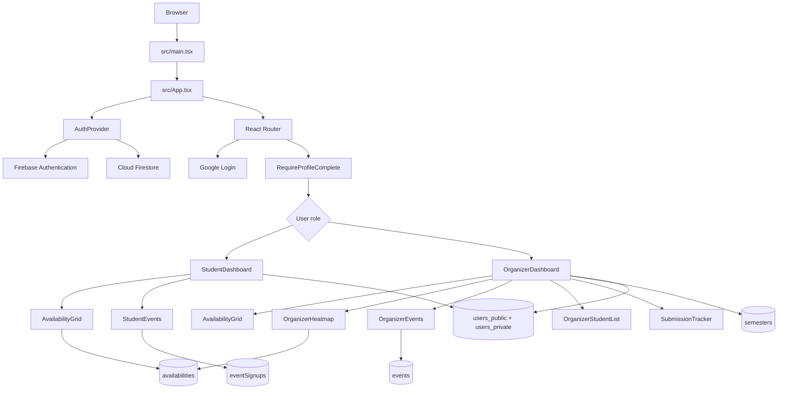

# CLC Outreach Availability Web Application

## 1. Product Overview

CLC Outreach Availability is a role-based web application for coordinating student availability and outreach events. It gives students one place to complete their profile, submit weekly availability, and join event time slots. Organizers get an operational workspace for managing semesters, reviewing team availability, tracking submissions, managing events, and viewing the student directory.

The application is currently a client-rendered React single-page application backed by Firebase Authentication and Cloud Firestore.

### Primary goals

- Replace manual availability collection with a structured weekly availability grid.
- Give organizers a live summary of when the team is available.
- Keep student identity data useful for coordination while separating public profile data from private contact data.
- Support multiple academic semesters without mixing historical submissions.
- Let organizers publish concrete outreach events with selectable dates and time windows.

### Current users

| Role | Main responsibilities |
| --- | --- |
| Student | Sign in, complete profile, submit availability, join or leave event slots, maintain profile data |
| Organizer | Manage semesters, submit personal availability, inspect the team heatmap, export summaries, publish events, track submissions, view student details |

## 2. Technology Stack

- **Frontend:** React 19, TypeScript, Vite
- **Routing:** React Router
- **Styling:** Tailwind CSS 4 through the Vite plugin
- **Icons:** Lucide React
- **Authentication:** Firebase Authentication with Google sign-in
- **Database:** Cloud Firestore
- **Hosting:** Firebase Hosting, serving the Vite `dist` directory
- **Linting:** Oxlint
- **Build:** TypeScript project build followed by Vite production build

Useful commands:

```bash
npm run dev
npm run build
npm run lint
npm run preview
```

Firebase configuration is read from `VITE_FIREBASE_*` environment variables. The required runtime values are the Firebase API key and project ID; the remaining Firebase application settings should also be supplied for a complete deployment.

## 3. Application Architecture



### Entry points

- `src/main.tsx` mounts the React tree and imports the global stylesheet.
- `src/App.tsx` creates the authentication provider and router.
- `/login` renders the login state when there is no authenticated user.
- `/` renders the role-specific dashboard.
- Unknown routes redirect to `/`.

The dashboard itself uses local tab state rather than a URL route for each workspace view. This keeps the current experience simple, but means tabs are not directly linkable or restorable through browser history.

## 4. Authentication and Session Flow

1. Firebase Auth watches the current session through `onAuthStateChanged`.
2. The user signs in through a Google popup.
3. The app reads `users_public/{uid}` and `users_private/{uid}`.
4. Existing legacy `users/{uid}` data is used during migration if the split profile documents do not exist.
5. Missing profile documents are created for the signed-in user.
6. The resulting `UserProfile` is stored in `AuthContext`.
7. The role determines whether `StudentDashboard` or `OrganizerDashboard` is rendered.
8. Signing out clears both the Firebase session and local profile state.

`AuthContext` is the central session API. It exposes:

- `user`
- `userProfile`
- `loading`
- `signInWithGoogle()`
- `logout()`
- `refreshProfile()`

The login screen includes user-facing handling for popup cancellation, blocked popups, unauthorized domains, invalid API keys, and missing Firebase configuration.

## 5. Profile Completion and Privacy Model

Profile data is intentionally split into two Firestore documents:

### `users_public/{userId}`

Data safe for authenticated directory-style use:

- `uid`
- `displayName`
- `photoURL`
- `faculty`
- `course`
- `yearOfStudy`
- `role`
- `createdAt`

### `users_private/{userId}`

Personal and contact data:

- `uid`
- `email`
- `phone`
- `gender`
- `race`
- `hometown`
- `college`
- `invitedByUserId`
- `invitedByName`
- `updatedAt`
- `isProfileComplete`

`userService.ts` updates both documents with one Firestore batch, so public and private profile changes commit together.

Students are expected to complete display name, faculty, course, year, phone, college, gender, race, and hometown before using the main workspace. Organizers are allowed to use their workspace without student-only profile requirements.

### Current access rules

- Any authenticated user can read `users_public`.
- A user can read and write their own private document.
- Organizers can read private documents for coordination purposes.
- Users cannot delete profile documents.
- Organizer role creation is restricted by the existing legacy organizer record during migration.

The profile split is a good foundation for privacy, but the application should eventually enforce field-level validation and explicit organizer administration rather than relying only on client role checks and broad collection reads.

## 6. Student Experience

### Student dashboard

The student workspace has three views:

1. **My Availability**
2. **Events**
3. **Profile**

On small screens, the views are exposed through a fixed bottom navigation bar. On larger screens, they appear in a horizontal tab strip inside the sticky header.

### Availability submission

`useAvailability` performs the following flow:

1. Finds the semester where `isActive == true`.
2. Loads the student availability document for that semester.
3. Lets the student toggle weekly day/time blocks in local state.
4. Saves one document using the deterministic ID `{userId}_{semesterId}`.

The current standard grid is:

- Monday through Sunday
- Morning: `08:00 - 11:00`
- Afternoon: `14:00 - 17:00`
- Evening: `19:00 - 22:00`

Slot keys use the form `DAY_TIME`, for example `MON_0800_1100`. The save operation stores the selected keys in the `slots` array and updates `updatedAt`.

### Event participation

Students see organizer-created events ordered by creation time. Each event contains one or more dates, and each date contains one or more joinable text time slots.

Signup IDs are deterministic:

```text
{userId}_{eventId}_{dateIndex}_{slotIndex}
```

This makes joining and leaving idempotent and avoids an extra lookup before toggling a signup. A signup stores a denormalized event name, student name, and email so later operational views can be rendered without reconstructing the original event or profile.

### Student profile

Students can edit identity, academic, contact, demographic, residential college, and inviter information. The profile page supports both an editing form and a read-only profile view after completion.

## 7. Organizer Experience

### Organizer dashboard views

The organizer workspace currently contains:

- **My Availability:** the same availability grid used by students.
- **Team Heatmap:** aggregates student submissions by day and time slot.
- **Events:** creates, edits, views, and deletes outreach events.
- **Directory:** searches students by name or course and filters by faculty.
- **Progress:** divides students into submitted and pending groups and calculates a submission rate.
- **Profile:** organizer profile management.

### Team heatmap

`useOrganizerHeatmap` loads public student profiles, maps private email values for organizer use, and reads all availability documents for the active semester. It produces:

- A count for each slot.
- The list of students available for each slot.
- The total number of students who submitted availability.

The UI lets an organizer select a day, inspect each time block, open the list of available students, copy a day summary, and download a CSV export.

### Submission progress

`useSubmissionTracker` compares all registered students with availability documents for the active semester. A student is counted as submitted only when their availability document contains at least one selected slot.

It returns:

- `submittedStudents`
- `pendingStudents`
- `totalStudents`
- `submissionRate`
- `loading`
- `error`

### Student directory

The directory first loads public student profiles, then applies client-side name/course search and faculty filtering. Private details are loaded only when an organizer opens a specific student, reducing unnecessary exposure of contact information in the main list.

### Event administration

Organizers can create events with:

- An event name.
- Multiple non-consecutive dates.
- Multiple custom time slots per date.

Events are stored in the `events` collection and ordered by `createdAt`. Organizers can edit or delete events.

### Semester administration

`useSemesterAdmin` lists semesters, creates new semesters, and changes the active semester. Activation uses a batch write to set the target active and deactivate other active semesters. Creating a semester can also activate it immediately.

The rest of the application treats the active semester as the current availability context, while old availability records remain associated with their original semester ID.

## 8. Firestore Data Model

| Collection | Document ID | Purpose |
| --- | --- | --- |
| `users_public` | Firebase user ID | Authenticated public identity and academic directory data |
| `users_private` | Firebase user ID | Private contact and profile completion data |
| `users` | Firebase user ID | Legacy migration source only |
| `semesters` | Application-defined semester ID | Academic term registry and active-term flag |
| `availabilities` | `{userId}_{semesterId}` | One student's weekly availability for one semester |
| `events` | Firestore-generated ID | Organizer-published event dates and slots |
| `eventSignups` | Deterministic signup ID | A student's signup for one event date/time slot |

### Representative documents

```json
{
  "users_public/{uid}": {
    "uid": "uid",
    "displayName": "Student Name",
    "photoURL": "https://...",
    "faculty": "FCSIT",
    "course": "Computer Science",
    "yearOfStudy": 2,
    "role": "student",
    "createdAt": "server timestamp"
  },
  "users_private/{uid}": {
    "uid": "uid",
    "email": "student@example.com",
    "phone": "0123456789",
    "college": "Alamanda",
    "isProfileComplete": true,
    "updatedAt": "server timestamp"
  },
  "availabilities/{uid_semester}": {
    "userId": "uid",
    "semesterId": "2026-2027-SEM2",
    "slots": ["MON_0800_1100", "WED_1900_2200"],
    "updatedAt": "server timestamp"
  },
  "events/{eventId}": {
    "name": "Community Food Drive",
    "dates": [
      { "date": "2026-10-03", "timeSlots": ["09:00 - 11:00"] }
    ],
    "createdAt": "server timestamp"
  }
}
```

## 9. Security and Data Integrity

Firestore rules currently enforce the main ownership boundaries:

- Authentication is required for application data.
- Students may write only their own profile and availability.
- Organizers may manage semesters and events.
- Organizers may read private student details.
- A student may create or remove only their own event signup.
- Event signup updates are disabled; join/leave is modeled as create/delete.

Before expanding the application, the following should be hardened:

1. Validate document field types and allowed values in rules, not just in TypeScript forms.
2. Prevent users from changing protected public fields such as `uid` and `role` through merge updates.
3. Add explicit constraints for availability `userId`, `semesterId`, and slot formats on both create and update.
4. Require organizer authorization from a controlled admin source rather than legacy profile data.
5. Add pagination or bounded queries for student, private profile, and availability reads.
6. Add Firestore emulator tests for student, organizer, and unauthorized access paths.
7. Consider whether organizer access to all private demographic fields is necessary, and reduce it to operationally required fields where possible.

## 10. UI and Visual Design

The interface is designed as a quiet operational workspace rather than a marketing site.

### Layout

- Sticky white headers keep identity and navigation visible.
- Content is constrained to a readable maximum width.
- Desktop navigation uses a tab strip.
- Mobile navigation uses a fixed bottom bar with safe-area padding.
- Cards and panels frame individual tools, forms, summaries, and detail views.
- Loading, empty, error, and success states are shown close to the relevant action.

### Visual language

- Warm stone neutrals provide the application background and text foundation.
- Indigo is the primary interaction color.
- Green represents successful saves or completed actions.
- Amber represents configuration or missing-semester warnings.
- Red represents failures and restricted access.
- Lucide icons provide consistent visual affordances.
- Availability and heatmap interactions use compact, tap-friendly cards.

### Responsive behavior

The interface is mobile-first for repeated student use. The availability grid, event slot controls, heatmap, and directory all use touch-sized controls and responsive layouts. The student directory switches from cards on small screens to a table on larger screens.

## 11. Project Structure

```text
src/
  App.tsx                         Application router and role switch
  main.tsx                        React entry point
  index.css                       Tailwind import
  components/
    AvailabilityGrid.tsx          Shared availability editor
    Login.tsx                      Google sign-in screen
    NavigationBar.tsx             Desktop and mobile navigation
    OrganizerDashboard.tsx        Organizer shell and tabs
    OrganizerEvents.tsx            Event CRUD interface
    OrganizerHeatmap.tsx           Heatmap and exports
    OrganizerStudentList.tsx       Student directory and detail modal
    ProfilePage.tsx                Profile display and editing
    RequireProfileComplete.tsx     Authentication route guard
    SemesterManagerModal.tsx       Semester administration modal
    StudentDashboard.tsx            Student shell and tabs
    StudentEvents.tsx               Event signup interface
    SubmissionTracker.tsx           Submission progress view
    UserSearchInput.tsx             Student search for inviter selection
  constants/
    unimasData.ts                  Faculties, colleges, years, genders
  context/
    AuthContext.tsx                 Firebase session and profile state
  hooks/
    useAvailability.ts              Active semester and availability state
    useOrganizerHeatmap.ts          Availability aggregation
    useSemesterAdmin.ts             Semester administration
    useSubmissionTracker.ts         Submission calculations
  services/
    firebase.ts                     Firebase initialization
    organizerService.ts             Organizer directory queries
    profileService.ts               Reserved profile service module
    userService.ts                  Profile reads and atomic writes
  types/
    index.ts                        Core application types
    user.ts                         Public/private profile types
  utils/
    exportUtils.ts                  Text and CSV exports
```

`firebase.json` configures Firestore rules and Firebase Hosting. The repository also contains root-level legacy/template entry files alongside the active `src/` application; the Vite configuration should remain the source of truth for which entry point is built.

## 12. Current Limitations

- Dashboard tabs are local state, so views do not have individual URLs.
- Active-semester selection assumes the query returns the intended single active semester.
- Heatmap and submission tracking load broad collections and will need pagination or aggregation as usage grows.
- Events are not yet scoped to a semester, organizer, capacity, or event status.
- Event signup does not enforce capacity, conflicting selections, attendance, or organizer-facing signup management.
- Availability uses a fixed weekly slot catalog even though events support custom time text.
- There is no automated notification system.
- There are no visible automated tests or Firestore emulator tests in the current project structure.
- The profile completion gate is partly implemented in the student dashboard rather than being a complete route-level policy.
- Some UI components use mixed visual conventions and color families, which should be consolidated as the product grows.

## 13. Expansion Roadmap

### Phase 1: Stabilize the current foundation

- Add component and hook tests for login state, profile completion, availability saving, semester activation, and signup toggling.
- Add Firestore emulator tests for every rule branch.
- Introduce shared constants and types for day and time-slot definitions.
- Make active semester uniqueness explicit in the data model or a trusted server-side operation.
- Add schema validation for Firestore reads and writes.
- Remove or clearly isolate unused and duplicate legacy entry files.

### Phase 2: Improve organizer operations

- Add URL-based routes for each dashboard view.
- Add organizer-facing event signup rosters.
- Add event capacity and waitlists.
- Add event status values such as draft, published, closed, and completed.
- Add semester-scoped event ownership and archive filters.
- Add richer exports for event rosters, pending students, and attendance.
- Add bulk messaging links or generated contact lists without exposing unnecessary private data.

### Phase 3: Make coordination proactive

- Add email or push notifications for new events, reminders, and schedule changes.
- Add due dates for availability submission.
- Show students their submitted slots and upcoming commitments together.
- Add reminders for incomplete profiles and pending availability.
- Add organizer announcements and an audit trail for important changes.

### Phase 4: Scale the data layer

- Move broad aggregation work to Cloud Functions or scheduled aggregation documents.
- Add denormalized semester summaries for fast heatmap loading.
- Add composite indexes based on production query patterns.
- Paginate directories, rosters, and historical submissions.
- Add offline-friendly optimistic updates where the workflow benefits from them.
- Introduce a typed service/repository layer so components do not issue Firestore queries directly.

### Phase 5: Mature permissions and administration

- Create a dedicated organizer/admin collection or custom claims workflow.
- Add organizer invitation and approval processes.
- Separate operational contact fields from sensitive demographic fields.
- Add audit logs for role changes, event deletion, semester activation, and profile access.
- Add rate limiting and server-side validation for high-value mutations.

### Phase 6: Product extensions

- Attendance check-in and post-event reporting.
- Volunteer hour tracking and downloadable certificates.
- Team assignment and shift balancing.
- Calendar export to Google Calendar or iCalendar.
- Analytics across semesters, faculties, colleges, and events.
- Multi-organization support if the application expands beyond CLC.

## 14. Recommended Future Architecture

As the application grows, keep the frontend organized around product capabilities while moving database policy and aggregation out of UI components.

```text
UI pages and components
        |
Feature hooks and view models
        |
Typed domain services / repositories
        |
Cloud Functions for trusted mutations and aggregation
        |
Firestore collections + scheduled summary documents
```

The most important architectural boundary to preserve is that the browser may render and request data, but it should not be the only place where authorization, role changes, capacity rules, notification decisions, or cross-user aggregation are trusted.

## 15. Definition of a Healthy Next Version

A strong next version of this application should have:

- URL-addressable student and organizer views.
- Emulator-backed security tests in CI.
- Server-validated schemas for all Firestore documents.
- A dedicated and auditable organizer role model.
- Semester-scoped events and signup rosters.
- Fast heatmap loading from precomputed summaries.
- Clear privacy boundaries for directory and contact data.
- Automated reminders and event notifications.
- Reliable exports and attendance history.
- A component-level design system for colors, spacing, buttons, forms, alerts, and navigation.

This preserves the current product idea while giving it a path from a useful coordination tool into a dependable outreach operations platform.